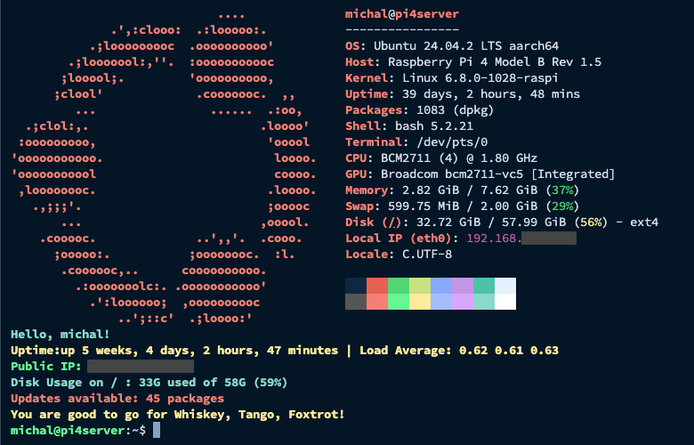

# Welcome Message Installer for Linux

A customizable, portable, and idempotent terminal welcome message for Linux systems. Get system info, weather, uptime, updates, and a touch of flair every time you log in.



---

## ✨ Features

- Works on most major Linux distros
- Terminal-friendly info from `fastfetch`
- Public IP, Disk usage, Load Avg, Updates, Weather
- Raspberry Pi-specific info (Temp, Throttling)
- Colorful output
- Easily customizable via `welcome.sh`
- Multi-language support (coming soon)
- Run once, run often – safely re-runnable ✅

---

## ⚡ Quick Install

Run this one-liner to install:

```bash
curl -s https://raw.githubusercontent.com/MichalAFerber/welcome-message/main/install-welcome.sh | bash
```

> Safe to run multiple times. Adds your custom `welcome.sh` and configures it in `.bashrc` or `.zshrc`.

---

## 📦 What It Does

- Installs required dependencies (`fastfetch`, `curl`, Raspberry Pi tools)
- Creates or updates `$HOME/welcome.sh`
- Appends to your shell config (`.bashrc` or `.zshrc`)
- Optionally installs to `/etc/profile.d/` for system-wide login messages

---

## 🛠 Customize

After install, edit your welcome message:

```bash
nano ~/welcome.sh
```

Change weather location:
```bash
WEATHER=$(curl -s 'wttr.in/Lake+City?format=3')
```

Add your own commands, ASCII art, or status info.

---

## 🌐 Language Support (Coming Soon)

This project will support multiple languages. Language files will be in `locales/`:

```
locales/
├── en.sh
├── es.sh
└── ...
```

We'll detect `LANG` or accept a `--lang` flag at runtime.

---

## 💻 Requirements

- Any Linux system with:
  - `bash` or `zsh`
  - `curl`
  - `fastfetch` (installed automatically)

Optional:
- Raspberry Pi tools for `vcgencmd` support

---

## 🧪 Test It Manually

```bash
~/welcome.sh
```

Or open a new terminal or SSH session.

---

## 🤝 Contributing

PRs welcome!
- Improve language support
- Add new info blocks (e.g. Docker status, CPU graphs)
- Report bugs or suggestions via Issues

---

## 📄 License

MIT License

---

## 🙏 Credits

- Inspired by [fastfetch](https://github.com/fastfetch-cli/fastfetch)
- Weather via [wttr.in](https://wttr.in)

---

> For more info, read the full blog guide: [Custom Linux Welcome Message](https://michalferber.me/blog/custom-linux-welcome-message)

Enjoy your new login experience. Whiskey, Tango, Foxtrot ready. 🫡

