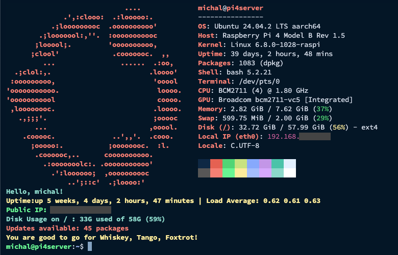

# 🖥️ Custom Welcome Message for Linux & macOS



Easily add a beautiful, dynamic welcome message to your Linux or macOS shell—complete with system stats, public IP, disk usage, weather, and multi-language support.


## 🚀 Features

- 💬 **Multi-language support** (auto-detected via `LANG`)
- 📦 **Fastfetch system overview** at login
- 🌐 **Weather, public IP, disk usage** report
- 💾 **System metrics dashboard** (memory, CPU usage)
- ⚡ **Performance optimized** with smart caching
- 🎨 **Customizable** via configuration file
- 🔒 **Security focused** with timeouts and error handling
- 🐚 **Bash & ZSH support**
- 📦 **Multi-distro support** (Ubuntu, Debian, Fedora, Arch, openSUSE, RHEL)
- 🍓 **Improved Raspberry Pi detection** and throttling status
- ✅ **Idempotent installer** — safe to run repeatedly
- 🧪 **Test mode** and **uninstall** options

## ⚙️ Installation

Run this command to install:

```bash
curl -s https://raw.githubusercontent.com/MichalAFerber/welcome-message/main/install_welcome.sh | bash
````

✅ You can re-run this any time — it will only update the script if needed.
### Installation Options

```bash
# Test mode - see what would be installed without making changes
curl -s https://raw.githubusercontent.com/MichalAFerber/welcome-message/main/install_welcome.sh | bash -s -- --test

# Skip dependency installation (if you already have curl and fastfetch)
curl -s https://raw.githubusercontent.com/MichalAFerber/welcome-message/main/install_welcome.sh | bash -s -- --no-deps

# Uninstall welcome message
curl -s https://raw.githubusercontent.com/MichalAFerber/welcome-message/main/install_welcome.sh | bash -s -- --uninstall

# Show help
curl -s https://raw.githubusercontent.com/MichalAFerber/welcome-message/main/install_welcome.sh | bash -s -- --help
```
## 🎨 Configuration

After installation, customize your welcome message by editing:

```bash
~/.config/welcome.sh/config
```

### Available Options

```bash
# Display toggles
SHOW_FASTFETCH=true          # Show fastfetch system info
SHOW_WEATHER=true            # Show weather from wttr.in
SHOW_PUBLIC_IP=true          # Show your public IP address
SHOW_SYSTEM_METRICS=true     # Show disk usage, memory, CPU temp, and top process
SHOW_ASCII_ART=false         # Show ASCII art banner
QUIET_MODE=false             # Minimal output for faster loading

# Customization
WEATHER_LOCATION=""          # Set your city (e.g., "New+York", "London")
CACHE_TIMEOUT=3600           # Cache duration in seconds (default: 1 hour)
REQUEST_TIMEOUT=3            # Timeout for external API calls (seconds)
```

Example configuration file: [config.example](config.example)

### Quick Customization Examples

**Enable ASCII art banner:**
```bash
echo "SHOW_ASCII_ART=true" >> ~/.config/welcome.sh/config
```

**Change weather location:**
```bash
echo "WEATHER_LOCATION=\"Tokyo\"" >> ~/.config/welcome.sh/config
```

**Speed up loading (disable slow features):**
```bash
cat >> ~/.config/welcome.sh/config << EOF
SHOW_WEATHER=false
SHOW_PUBLIC_IP=false
QUIET_MODE=true
EOF
```

## 🗣️ Language Support

The installer detects your system language using `LANG` and fetches a matching `welcome.sh.template.{lang}`.
Currently available: `en`, `es`, `nl`, `fr`, `de`.
If no matching template is found, the script will display all available templates and automatically use English.

You can temporarily force a language without changing your system locale permanently:

```bash
LANG=fr_FR.UTF-8 LANGUAGE=fr \
bash <(curl -s https://raw.githubusercontent.com/MichalAFerber/welcome-message/main/install_welcome.sh)
```

## 🚀 Performance Optimizations

- **Smart Caching**: Public IP and weather data are cached for 1 hour by default
- **Timeouts**: External API calls timeout after 3 seconds to prevent hanging
- **Quiet Mode**: Disable resource-intensive features for faster loading
- **Conditional Checks**: System metrics only run when needed

Cache files are stored in: `~/.cache/welcome.sh/`

## 🧪 Safe, Smart, and Idempotent

* Uses content comparison (not hashes) to determine updates
* Adds hook to `.bashrc` and `.zshrc` if needed
* Will not duplicate or overwrite if already installed
* Test mode available to preview changes
* Clean uninstall option removes all files and hooks

## 🐧 Distribution Support

### Supported Platforms
- **Linux**: Ubuntu, Debian, Fedora, RHEL, CentOS, Arch Linux, Manjaro, openSUSE, SUSE Linux, Raspberry Pi OS
- **macOS**: Fully compatible with Bash and Zsh (Homebrew installation recommended)

### Supported Package Managers (Linux)
- **APT** (Debian, Ubuntu, Raspberry Pi OS)
- **DNF** (Fedora, RHEL 8+)
- **YUM** (CentOS, RHEL 7)
- **Pacman** (Arch Linux, Manjaro)
- **Zypper** (openSUSE, SUSE Linux)

### macOS Installation

On macOS, you'll need **Homebrew** to install dependencies. If you don't have Homebrew installed yet:

```bash
/bin/bash -c "$(curl -fsSL https://raw.githubusercontent.com/Homebrew/install/HEAD/install.sh)"
```

Then install the required dependencies:

```bash
brew install curl fastfetch
```

Finally, run the installer:
```bash
curl -s https://raw.githubusercontent.com/MichalAFerber/welcome-message/main/install_welcome.sh | bash
```

**Note:** The installer will automatically detect macOS and skip Linux-specific package managers. Just ensure `curl` and `fastfetch` are installed via Homebrew first.

### Raspberry Pi
Improved detection using multiple methods:
- `/proc/device-tree/model` check
- `/boot/config.txt` presence
- Automatic `libraspberrypi-bin` installation
- Throttling status monitoring

## 📦 Dependencies

These are installed automatically (unless `--no-deps` is used):

* `bash`, `curl`
* `fastfetch` (via distribution package manager or PPA)
* `libraspberrypi-bin` (only on Raspberry Pi)

Ubuntu 22.04+ users benefit from a Fastfetch PPA for latest builds.

## � System Metrics Dashboard

When `SHOW_SYSTEM_METRICS=true`, the welcome message includes:
- **Disk Usage**: Disk space on `/`
- **Memory Usage**: Shows used/total memory with percentage (uses `vm_stat`/`sysctl` on macOS, `free` on Linux)
- **Top CPU Process**: Displays the most CPU-intensive process (hidden in quiet mode)
- **CPU Temperature**: Multi-method temperature detection

Always shown (independent of `SHOW_SYSTEM_METRICS`):
- **Package Updates**: Works across multiple package managers
- **Reboot Status**: Warning if system reboot is required
- **Throttling Status**: Raspberry Pi throttling detection

## �📂 Directory Layout

```bash
.
├── install_welcome.sh
├── config.example
└── templates/
    ├── welcome.sh.template.en
    ├── welcome.sh.template.es
    ├── welcome.sh.template.nl
    ├── welcome.sh.template.fr
    └── welcome.sh.template.de
```

Want to contribute a translation? Add a new `welcome.sh.template.xx` file!

## 🧠 Advanced Usage

### Manual Update
To manually trigger an update, just rerun:

```bash
curl -s https://raw.githubusercontent.com/MichalAFerber/welcome-message/main/install_welcome.sh | bash
```

### Testing Configuration Changes
After editing your config file, test it immediately:

```bash
~/welcome.sh
```

### Temporary Disable
Comment out the hook in your shell rc file:

```bash
# ~/.bashrc or ~/.zshrc
# ~/welcome.sh
```

### Custom Installation
Download and modify the template locally:

```bash
curl -O https://raw.githubusercontent.com/MichalAFerber/welcome-message/main/templates/welcome.sh.template.en
# Edit welcome.sh.template.en as desired
mv welcome.sh.template.en ~/welcome.sh
chmod +x ~/welcome.sh
```

### Docker/VM Testing
To test in a clean shell environment, use Docker or a VM:

```bash
docker run -it ubuntu:22.04 bash -c "curl -s https://raw.githubusercontent.com/MichalAFerber/welcome-message/main/install_welcome.sh | bash && bash"
```

## 🤝 Contributing

Pull requests are welcome! Especially for:

* 🌍 **Translations** (`templates/welcome.sh.template.xx`)
* 💡 **Feature ideas** and enhancements
* 🐞 **Bug fixes** and improvements
* 📚 **Documentation** improvements
* 🎨 **ASCII art banners** and visual enhancements

### Adding a New Language

1. Copy an existing template: `cp templates/welcome.sh.template.en templates/welcome.sh.template.xx`
2. Translate all user-facing strings
3. Test the template: `bash templates/welcome.sh.template.xx`
4. Submit a pull request

## 🆘 Troubleshooting

### Welcome message doesn't show
- Check if the hook exists: `grep welcome.sh ~/.bashrc ~/.zshrc`
- Test manually: `~/welcome.sh`
- Check for errors: `bash -x ~/welcome.sh`

### Slow loading
- Enable caching (default is enabled)
- Disable weather: `echo "SHOW_WEATHER=false" >> ~/.config/welcome.sh/config`
- Disable public IP: `echo "SHOW_PUBLIC_IP=false" >> ~/.config/welcome.sh/config`
- Enable quiet mode: `echo "QUIET_MODE=true" >> ~/.config/welcome.sh/config`

### Temperature not showing
- Install `lm-sensors`: `sudo apt install lm-sensors` (Ubuntu/Debian)
- Run sensors detection: `sudo sensors-detect`

### Fastfetch not found
- Manually install: `sudo apt install fastfetch` or check your distro's package manager
- On older Ubuntu: The installer will try to add the PPA automatically

### Apt signature verification warnings
You may see warnings like `W: An error occurred during signature verification` during installation on systems with third-party repositories (e.g., NodeSource for Node.js). These warnings are:
- **Not caused by the welcome-message installer**
- Typically from deprecated SHA1 signatures in third-party repos
- Safe to ignore — they don't affect the welcome-message installation
- The installer handles these gracefully and will continue normally

These are system-level warnings from your package manager when updating repository metadata, not from this project.

## 📄 License

[MIT License](LICENSE)

## 🙏 Credits

* Inspired by [fastfetch](https://github.com/fastfetch-cli/fastfetch)
* Weather via [wttr.in](https://wttr.in)

> For more info, read the full blog guide: [Custom Linux Welcome Message](https://michalferber.me/2025-07-07-custom-linux-welcome-message/)

Enjoy your new login experience. Whiskey, Tango, Foxtrot ready. 🫡
